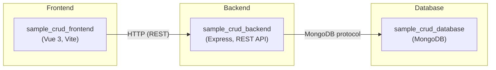

# Architecture Overview: Sample Fullstack CRUD Application

## Introduction

This document provides a comprehensive architecture overview of the sample CRUD application, which demonstrates best practices in designing, developing, and deploying a fullstack solution. The system consists of a Vue frontend, an Express backend, and a MongoDB database. This documentation is intended for developers looking to understand the application's structure, technology choices, major workflows, inter-container communications, and deployment.

---

## Architectural Summary

The application is structured as a classical 3-tier web stack:
- **Frontend/UI:** Built using Vue 3 (with Vite and Pinia), providing a modern, interactive user experience.
- **Backend/API:** Node.js Express app exposing RESTful endpoints, handling data access, validation, and business logic.
- **Database:** MongoDB, storing and indexing item records with enforced JSON schema validation.

The containers and their interactions align with a clear separation of concerns, making the application maintainable and scalable.

---

## Container Breakdown and Interactions

### 1. Frontend (`sample_crud_frontend`)

- **Tech:** Vue 3, Vite, TypeScript, Pinia (state), Axios (HTTP)
- **Features:** 
  - CRUD operations (List, Create, Edit, Delete)
  - Form validation
  - Loading and error states
  - Responsive design with modern styling
- **Structure:** 
  - `src/` directory with components, views, and store.
  - Page routing (with Vue Router) for home, about, create/edit/list views.
  - Uses environment variable `VITE_BACKEND_URL` or defaults to `http://localhost:3001` to connect to backend.

**Key Flow:**  
The user interacts with forms and tables. Requests (GET, POST, PUT, DELETE) are sent via Axios to the backend REST API. All item data comes from backend endpoints.

**Deployment:**  
Runs as a separate process (default port 3000), serving a SPA, and expects the backend endpoint URL to be CORS-enabled.

---

### 2. Backend (`sample_crud_backend`)

- **Tech:** Node.js, Express, MongoDB native driver, Swagger, ESLint, Jest
- **Features:** 
  - RESTful API endpoints for `/items` and `/items/:id`
  - Health check endpoint (`/`)
  - JSON body parsing, CORS support, detailed error handling
  - Swagger/OpenAPI docs auto-generated from source (`/docs`)
  - Robust directory separation: controllers, routes, models, services, middleware.
  - Form and schema validation at API and model level

- **Structure:**  
  - `src/app.js`: Express app configuration (CORS, routes, Swagger, middleware)
  - `src/routes/index.js`: HTTP routing and API documentation (Swagger JSDoc)
  - `src/controllers/`: Methods mapping to business logic for item operations and health
  - `src/services/db.js`: MongoDB client connection and retrieval
  - `src/services/item.js`: Main CRUD logic for MongoDB operations on the "items" collection

**Key Flows:**  
- Receives REST requests from the frontend, processes (including validation), and interacts with the MongoDB database.  
- Utilizes environment variables `MONGODB_URL`, `MONGODB_DB` for DB connectivity.
- Provides HTTP Swagger documentation generated automatically from annotated source code.

**Deployment:**  
Runs as its own server (default port 3001), with configuration via environment or command line. Expects MongoDB to be running and accessible.

---

### 3. Database (`sample_crud_database`)

- **Tech:** MongoDB, Shell scripting for setup, Node.js initializer
- **Features:** 
  - Holds all application data (`items` collection).
  - Enforces JSON schema validation at the collection level.
  - Setup scripts to initialize database, users, schema, and environment files.

- **Structure:**
  - `init_mongodb.js`: Node.js script to initialize collection with schema
  - `startup.sh`: Bash script to start MongoDB, create users, set environment
  - `db_visualizer/`: Utilities and environment file for DB access (`mongodb.env`)

**Key Flow:**  
The database is started and initialized by `startup.sh` (or containerized equivalent), with users and schema set as required. The backend connects using the credentials/environment variables created by this process.

**Deployment:**  
Typically runs on port 5000 (configurable in startup script). Authentication is always required. The DB can be accessed via any MongoDB-compliant client using supplied credentials.

---

## Deployment Diagram (mermaid)

---

## Main Flows

### CRUD Item Lifecycle
1. **User Action:** User lists, creates, edits, or deletes an item via the frontend.
2. **Frontend:** Sends REST API request using Axios to Express backend (`/items`, `/items/:id`).
3. **Backend:** Validates data, performs the relevant database operation (via MongoDB driver).
4. **Database:** Operation is checked against JSON schema, performed if valid.
5. **Backend->Frontend:** API responds with result or error. UI updates accordingly.

### Health and Observability
- Backend exposes `/` as a health endpoint and `/docs` for live API documentation via Swagger UI.

### Validation and Error Handling
- Frontend performs basic input validation; backend performs required and type validation.
- MongoDB enforces strict collection schema validation.

---

## Technology Choices and Rationale

- **Vue 3 (Vite):** Modern, reactive, easily maintainable for complex UIs.
- **Express (Node.js):** Lightweight, robust, and widely supported for REST APIs.
- **MongoDB:** Schema flexibility, JSON document storage, popular for rapid development.
- **Swagger/OpenAPI:** Ensures clear API documentation and improves API usability/integration.

---

## Environmental Variables

- **Frontend:** Reads `VITE_BACKEND_URL` for backend location.
- **Backend:** Reads `MONGODB_URL` and `MONGODB_DB` for database credentials (provided via environment, e.g., from `.env` or `db_visualizer/mongodb.env`).
- **Database:** Managed by startup scripts; credentials and connection info saved for access.

---

## Deployment notes

- Each container can be deployed and scaled independently.
- The database credentials should be securely managed. The startup process writes an environment file for easy integration.
- API server serves OpenAPI documentation for developer reference at `/docs`.
- CORS is configured for cross-origin communication between frontend and backend.

---

## Summary

This application is a portable demonstration of typical fullstack CRUD design. By separating concerns among frontend UI, backend API, and database—with clear interfaces and modern tooling—it provides an easily comprehensible, extensible, and maintainable development pattern for similar real-world projects.

---

**Sources Used:**
- sample_crud_frontend: folder structure and core files (`main.ts`, `api/items.ts`, views, components)
- sample_crud_backend: `package.json`, `src/app.js`, `src/routes/`, `src/services/`, OpenAPI JSON, and Swagger source files
- sample_crud_database: `README.md`, `init_mongodb.js`, `startup.sh`, `db_visualizer/mongodb.env`, and schema/script files

